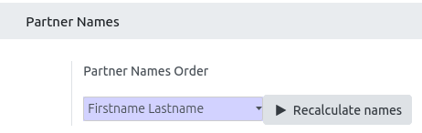
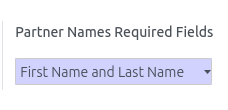

**Fields Order**

You can configure some common name patterns for the inverse function in
Settings \> General settings:

- Lastname Firstname: For example 'Anderson Robert'
- Lastname, Firstname: For example 'Anderson, Robert'
- Firstname Lastname: For example 'Robert Anderson'

  

After applying the changes, you can recalculate all partners name
clicking "Recalculate names" button. Note: This process could take so
much time depending how many partners there are in database.

You can use *\_get_inverse_name* method to get lastname and firstname
from a simple string and also *\_get_computed_name* to get a name form
the lastname and firstname. These methods can be overridden to change
the format specified above.

**Required Fields**

you can configure if firstname and / or lastname are required, in "Settings \> General Settings": 

  
